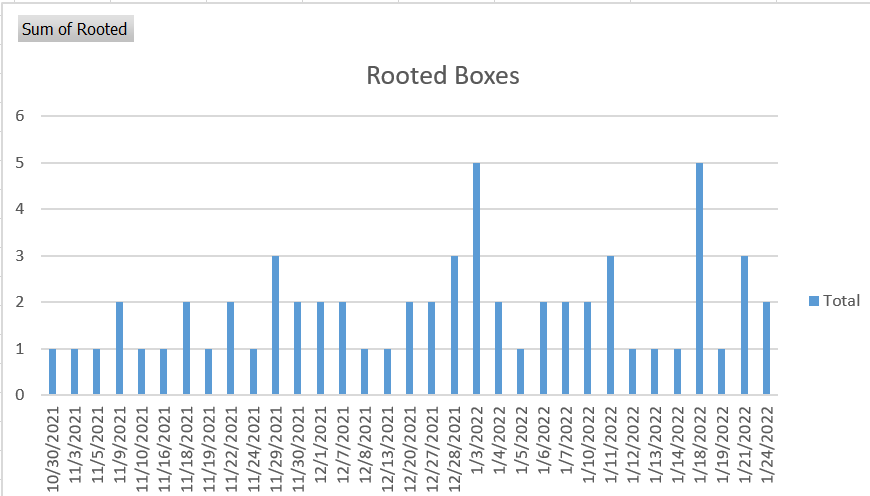

# My Exam Day

## 80 Points - Adset + 2 Roots

## My Background

Been in IT related fields for over 10 years

Been in CyberSecurity last 4 but on the Defensive side

OSCP journey started \~ 6 months ago

* Joined OSCP Academy
  * OSCP Academy included 90 days of PWK&#x20;
  * 2 mentors
  * Class of \~30 people of various experience and backgrounds
  * 1 - 2 weekly group meetings to cover the material
  * PTAP - CTF version of exercises (I believe the new Topics are comparable)
  * Option for 1-1 Meetings with the mentors
  * Discord channel dedicated to the academy, and an alumni channel once completed
  * CTF challenge on the Enterprise Proving Grounds

### PWK&#x20;

knocked 69 boxes

Cleared all of the Admin subnet

Had 1-2 boxes in the other 3 subnets each

I did not complete the exercises

### Proving Grounds

* knocked out over 60 boxes during 2 months worth of PG Practice
* I took hints/walkthroughs after getting stuck for an hour on a box, I feel like it was more important to be familiar with more techniques than it was to sit and fight over it for days ( my opinion, but sometimes its not bad to "Try Harder" just not all the time). I got really good at finding the right path... but that last 10% kept getting me.
* Followed walkthroughs on about 10 Try Harder Boxes
  * I would attempt first to find the direction and after about 15-20 min of trying I would look up to where I was in the walkthrough to see if I was even going in the right direction.

### Hack the Box

less than 10 boxes (I feel like the creators there are more of hey look what I can do... which is not bad just not OSCP prep)

### Try Hack Me

99% done with the Offensive Security Path (2 BOF challenges left). I had the OSCP BOF room down to about 10 min on the last two challenges.

## Exam Timeline

Started in the morning, late enough to do breakfast and read the morning reddit and then have some time to take a break for lunch a couple hours in.

I highly encourage everyone to check out Rustscan for initial enumeration... I had all the ports/services on the boxes in under 20 minutes and could figure out my attack plan.

Spent an hour up front trying to get a foothold an AD... pivoted to my BOF that I had and ended rooting that box in under 2 hours.

Retargeted the AD again and spent another 4-5 hours when I finally found the foothold. Spent the next hour or so getting my lateral movement when I shot myself in the foot by not copying something right.. but figured it out and got my AD before Dinner time!

After some grub I focused on my last 2 boxes... one I never saw the foothold and wrote it off. The last box I saw the way in (after running my port scan again and found the vulnerable service). Don't be afraid to run port scans a couple of times.

I got my foothold for 70 points so I felt good about that, but it was not "right user" so I was still worried that I might not get credit for that box unless I pushed further, well that ended up paying off because at 12.5 hours in I got root on that box.

One last tip I have for everyone looking to take the test... plan on how you can still look for what you need 4+ tools deep... because the first 3+ might not work/find what you are looking for.

Spent the last 12 hours sleeping and re-exploiting everything to make sure I got all the documentation that I needed.

I ran into issues uploading my report, but after about 8 hours it was sent off.

* Apparently when you have 3 different virtual software installed and a bridged NIC.... it did not like what I wanted to accomplish.
* Copied my report over to another computer and it was sent off in a matter of minutes.

## Exam Review

Overall I think the OSCP is very entry level on what it covers, while the material covers a lot of information, it is not enough alone to tackle this exam. What I think helped me on this is that I did have a large foundation. The best practice I feel is repetition and covering the numerous ways to get onto a box. I do feel that knocking out 50+ boxes in the PWK labs is a very doable target even if you complete the exercises, as long as you do not spend an entire week stuck in one spot. A good goal I believe is to knock out 5 boxes a week.

Here is my PWK Root history:

I am looking forward to starting in the future the Pen-300 where the defenses of the targets get turned on and makes for a more realistic attack.
